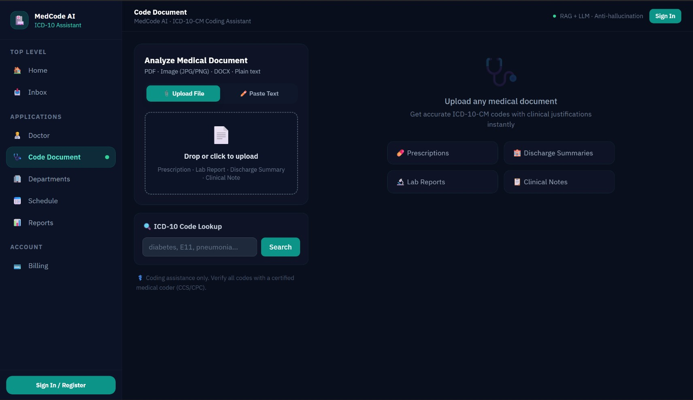
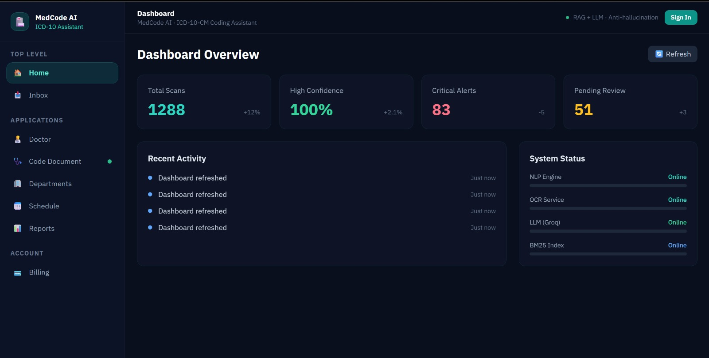
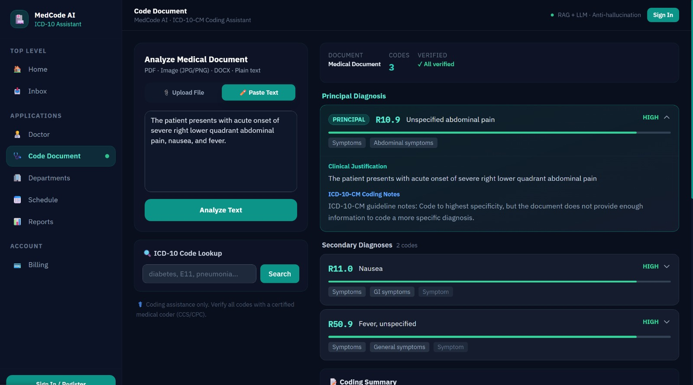

# MedCode AI v2 — Intelligent Medical Coding Assistant

MedCode AI is an advanced AI-powered tool designed to automate and enhance medical coding workflows. It processes medical reports using OCR and Large Language Models (LLMs) to accurately extract relevant medical data and provide actionable insights.

## Core Features
- **ICD-10 Code Extraction**: Automatically identifies and maps diagnoses to accurate ICD-10 codes.
- **Drug Interaction Alerts**: Flags potential adverse interactions between prescribed medications.
- **Abnormal Value Flagging**: Highlights lab results and vitals that fall outside normal reference ranges.
- **Allergy Risk Assessment**: Identifies patient allergies and cross-references them against current medications.
- **TSV Export**: Easily export extracted structured data for integration with EHR/EMR systems.

## Interface & Workflows

### 1. Document Upload & Code Lookup

The platform offers a seamless interface for uploading various medical documents, including PDFs, images (JPG/PNG), DOCX, and plain text. Users can quickly submit prescriptions, discharge summaries, or clinical notes for instant processing. Additionally, a built-in search tool allows quick manual lookup of specific ICD-10 codes.

### 2. Live Dashboard Analytics

A comprehensive dashboard provides real-time insights into system usage and performance. Track total document scans, AI confidence scores, and critical alerts that require immediate attention. The dashboard also monitors the live status of underlying microservices like the NLP Engine, OCR Service, and the LLM infrastructure.

### 3. Deep AI Medical Analysis & Coding (Core Engine)

This is the heart of MedCode AI. Once a document is processed, the system doesn't just provide a list of codes—it generates a deeply verified, comprehensive breakdown:
- **Principal & Secondary Diagnoses**: Accurately maps clinical text (e.g., "acute onset of severe right lower quadrant abdominal pain") to precise ICD-10-CM codes (e.g., *R10.9 Unspecified abdominal pain*).
- **Clinical Justification**: Extracts and highlights the exact sentence from the source text that justifies the code, preventing AI hallucination.
- **Official Coding Notes**: Cross-references against official ICD-10-CM guidelines (e.g., reminding the coder to code to the highest specificity if more info is provided) to ensure compliance and accuracy.
- **Confidence Verification**: Each code is verified by the RAG + LLM anti-hallucination engine, allowing medical coders to trust the results and save hours of manual lookup.

## Prerequisites
- Python 3.9+ (recommended), Node.js 18+
- Tesseract OCR installed
- Groq API key (free): https://console.groq.com

## Run in 5 minutes

### 1. Backend Setup
```bash
cd backend
python -m venv venv
venv\Scripts\activate          # Windows
# OR: source venv/bin/activate  # Mac/Linux
pip install -r requirements.txt

# If Python 3.14: fix tesseract compatibility
python ..\fix_python314.py

copy .env.example .env         # Windows
# OR: cp .env.example .env     # Mac/Linux
# → Edit .env and add your GROQ_API_KEY

python app.py
```

### 2. Frontend Setup
```bash
cd frontend
npm install
npm run dev
```

Open **http://localhost:3000** in your browser.

---

*Note: This application also includes extended modules like Razorpay subscription integration, Email reporting, and WhatsApp sharing. These are optional, and the core application will run seamlessly in demo mode if their respective API keys are not provided.*
